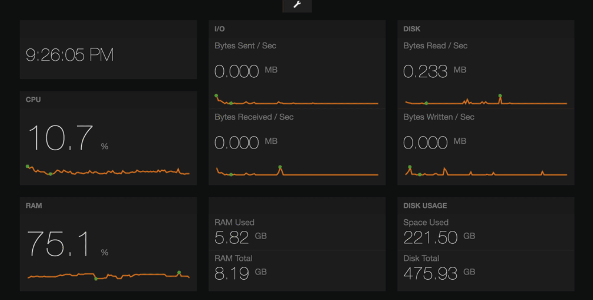

# System.Dashboard
This repository is a System Dashboard for Python 2/3 using Flask and Freeboard. The cross-platform system information is derived from the psutil Python package, which is exposed by a minimal Flask API and retrieved by Freeboard. This data includes:

- CPU %
- RAM %
- Disk Read/Write
- Bytes Sent/Received
- RAM Used/Total
- Disk Used/Total

### Screenshots

## How to use
- git clone https://github.com/coffeina/System.Dashboard.git
- cd System.Dashboard
- install python dependencies: `pip3 install psutil flask flask_cors`
- to start Flask server: `python3 flask_system.py`
- open up a Freeboard window by opening `system_dashboard.html` in any browser
- select Load Freeboard and choose `system_daskboard_flask.json`

## License

